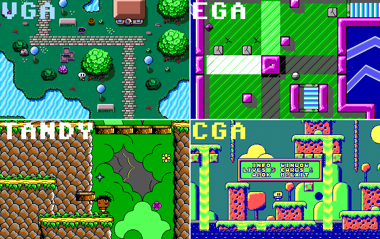

# OptiDOS
OptiDOS Game Engine optimized for CGA/TANDY/EGA/VGA and very slow computers (8088/8086/286)
----------------------------------------------------------------------------



OptiDOS Game Engine is a very simple "game engine" forked from Little Game Engine.
This forked Engine is more optimized from Little Game Engine.
Also I remain function names for compatibility with Little Game Engine. so if you using Little Game Engine, I recommend try this.

The engine is using the common 320x200 mode, but it has been tweaked to run at 60 Hz on VGA.

NOTE:  

This was created for the absolute low end computer, and the engine runs at 60 fps (which is insane for the poor 8088's), so a lot of things have been simplified or removed from the engine:
- Blocky CGA sprites: choppy, using 4x1 pixel chunks... but they look good enough for me.
- EGA sprite colors: EGA is so slow for sprite drawing, I use a simple colouring method, which changes the sprite colour every 2 scanlines. 
- 32x32 sprites: these are only fast in EGA mode, but they lack a lot of details in this mode.


NEW :

- Optimized Codes
- VGM loop support

The predefined controls are:
- Move player/menus = UP DOWN LEFT RIGHT arrows or joystick.
- Jump in platform levels = D / button 2.
- Show info window in levels = S / button 1.
- choose option in menu = ENTER / button 1.
- Exit stage/game = ESC.

So. why does it run so fast?
----------------------------

- Uses Hardware scrolling (CGA, Tandy, EGA and VGA have this function, but only EGA and VGA can do 1 pixel smooth scrolling).
- VRAM to VRAM transfers on EGA/VGA (4 pixels at a time on VGA, and 8 pixels on EGA).
- Updates only one column of tiles, and the sprites.
- Very simple "physics".

REQUIREMENTS
------------

I tested the requirements on PCem, 86Box and martyPC emulators (they simulate very accurately 8088 based systems).
Also tested on a 286 at 6 MHz and 8088/NEC V20 from 4.77 to 10 MHz.

                  minimum                              recommended

          CPU: 8088/NEC V20 4.77 MHz          8088/NEC V20 7.16 MHz
          RAM: around 400 Kb                  512 Kb (640 for Tandy Graphics)
          GRAPHICS: CGA                       EGA (128Kb), VGA (256Kb)
          SOUND: PC Speaker                   Tandy / Adlib or OPL2 compatible


Notes about minimum requirements:

          CGA: Runs slow, sprites will flicker a lot, but engine is playable if music is not enabled.
          Tandy: Runs slow, you should disable music.
          EGA: Can only handle 3 (16x16) or 2 (32x32) sprites at full speed.
          VGA: Runs slow.
  
From 286+ CPU, the engine just works ok, even on modern cpu's x86 / x64 (2022) using freedos and any GPU

Little Engine functions:
------------------------

- 320x200 60 FPS MODE, compatible with all cards
- Images in BMP format: 16 / 256 colours bmp, supports RLE compression and color space info generated by modern editors (GIMP).
- Sprites 8x8, 16x16, 32x32, 64x64 sprites (64x64 sprites don't support transparencies).
- TMX maps: Map sizes are fixed 256x19 tiles, created with tiled: https://www.mapeditor.org/
- Graphic print function (8x8 Fonts, 64 characters). Includes latin characters by destroying these: "#$%&\()+-<=>
- Hardware scroll (choppy on CGA/Tandy, smooth on EGA and VGA).
- Palette animation 64+8 colors on VGA, 4 colors on EGA/TANDY (animations for water and similar things).
- Fake Parallax on VGA (64 colors palette animations)
- VGM music for TANDY (SN76496 or compatible) and Adlib (YM3812 or compatible). 

SOUND
-----

To use Tandy or adlib music, just enable Tandy, Adlib or SoundBlaster in the emulator, fpga... or connect an Adlib/SB card to your retro PC.
Create Tandy and Adlib VGM files with any tool you like, there is an awesome tracker called Furnace Tracker that will export VGM files and they 
will work great. VGM files must be around 60 Hz and smaller than 64 KB.

DAT FILES
---------

DAT files are a container which stores multiple smaller files, so program distribution is easier.
DAT files in BIN folder were generated from the files in `ASSETS` folder.
To generate a DAT file, use `makedat` program in `UTIL_DAT` folder (use command line or drag and drop multiple files or a folder).

Install, Make and Run
---------------

Assuming you use DOSBOX to compile:

* Install the required compiler in drive C:
	```
	Borland Turbo C++ 3.0
	Borland Turbo Assembler 2.0 
	```
* SET paths: 
	```
	set PATH=Z:\;C:\TC\BIN;C:\TASM
	```
* Go to BIN folder, and run `makedemo.bat` to make the EXE file.

To create your own game, you only need to modify 'main.c' and compile again, if you want to edit the engine code (LT_LIB.LIB) 
run `makelib.bat` from main folder, to recompile  LT_LIB.LIB.

A lot of code from David Brackeen                                   
http://www.brackeen.com/home/vga/                                     

This is a 16-bit MS-DOS program, it will only work on pure MS-DOS and FreeDos, (maybe on windows 95/98?). It will fail under windows 3.1/11                     
You have to compile using the LARGE memory model. 

Please copy this source code, change it, do whatever you want. That's the point of github. Isn't it?

NOTES
-----
- 	Read source to see how the functions are used in the samples, I tried to leave it as simple as possible.
- 	Little Engine uses 16x16 pixels tiles, and it will split the tilesets in chunks of 16x16 pixels (from left to right / top to bottom).
- 	Sprites are split in chunks of 8x8, 16x16, 32x32, 64x64.
- 	EGA sprites are 256 colour bmp (8 bits per pixel) but they only use these colors: 16 = transparent, 1 = black; 2-15 = any EGA color.  
 	Every group of two lines on the sprite, can only use 2 colors (black + other color).
- 	Font is a 16 colour bmp (4 bits per pixel) but it only uses 4 colors.
- 	TMX maps must be in CSV format 256x19, orthogonal and must have two layers (background and collision).
- 	All files (tilesets, maps, music and sprites) are limited to 64 kb. 
- 	Only one song, one map and one tileset can be loaded at the same time.
	Doing this, a lot of malloc trouble is fixed, the code is simplified and the engine works like a console.
	So every time you load a map, tileset or music, the last one is overwritten.
-	If a bmp is loaded as an image, map data will be erased.	
